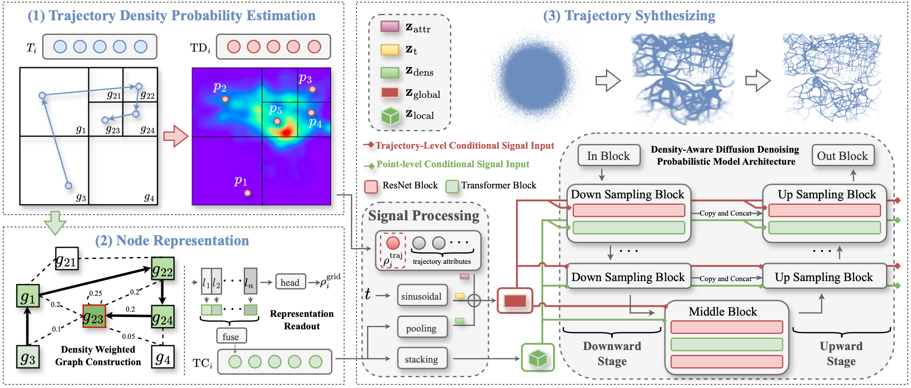

# FairTraj

FairTraj is a density-aware generative data augmentation method for fairness in downstream trajectory learning tasks.



## Project Structure

```text
.
├── assets/
│   └── fairtraj_overview.png
├── configs/
│   └── fairtraj_core.yaml
├── src/
│   └── fairtraj/
│       ├── models/
│       │   ├── ddpm.py
│       │   └── dwgat.py
│       ├── generation/
│       │   └── generate.py
│       ├── preprocessing/
│       │   └── density.py
│       ├── training/
│       │   └── train_ddpm.py
│       └── utils/
│           ├── ema.py
│           ├── quadtree.py
│           └── trajectory.py
├── LICENSE
├── requirements.txt
└── pyproject.toml
```

## Requirements

You can install the required packages in your python environment by:

```text
Python == 3.8
torch
pandas
numpy
matplotlib
scipy
scikit-learn
torch-geometric
tqdm
geopy
PyYAML
```

Install the local package before running the commands below:

```bash
pip install -r requirements.txt
pip install -e .
```

## Data Format

The core preprocessing command expects a trajectory text file with one GPS point per line:

```text
timestamp latitude longitude
timestamp latitude longitude
-1
timestamp latitude longitude
...
-2
```

Lines beginning with `-` separate trajectories. Coordinates are expected as latitude and longitude in decimal degrees.

## Workflow

FairTraj contains four core stages.

### 1. Estimate Trajectory Density

Given raw trajectories, estimate point/trajectory density, construct the density-aware graph, train DW-GAT, and prepare DDPM tensors:

```bash
python -m fairtraj.preprocessing.density \
  --trajectories /path/to/trajectories.txt \
  --output-dir outputs/fairtraj_core \
  --capacity 6000 \
  --search-radius 3000 \
  --epochs 3000
```

This produces:

- `qdtree.pkl`: fitted quadtree with node densities
- `nodes.pkl`: quadtree leaf nodes
- `graph_data.pt`: density-aware graph data
- `dwgat.pth`: DWGAT checkpoint
- `density_conditions.pkl`: trajectory-level density-aware condition sequences
- `trajs.pkl`, `attrs.pkl`, `stats.pkl`: normalized DDPM training data and normalization statistics
- `source_*_train.pkl`, `target_*_train.pkl`: density-based source/target splits for FairTraj training

### 2. Learn Density-Aware Node Representations with DW-GAT

This stage is executed inside the preprocessing command in Stage 1. The DW-GAT module is not meant to be run directly as a standalone script.

The implementation is in:

```text
src/fairtraj/models/dwgat.py
```

During Stage 1, `fairtraj.preprocessing.density` builds `graph_data.pt`, calls DW-GAT training, saves `dwgat.pth`, and uses the learned node embeddings to produce density-aware point-level conditional signals.

### 3. Train Density-Aware DDPM

Train the FairTraj denoising diffusion model with the prepared source/target tensors:

```bash
python -m fairtraj.training.train_ddpm \
  --config configs/fairtraj_core.yaml \
  --data-dir outputs/fairtraj_core \
  --output-dir outputs/ddpm
```

This produces DDPM checkpoints such as:

```text
outputs/ddpm/models/unet_200.pt
```

### 4. Generate Augmented Trajectories

Use a trained DDPM checkpoint and the low-density target conditions to synthesize augmented trajectories:

```bash
python -m fairtraj.generation.generate \
  --config configs/fairtraj_core.yaml \
  --data-dir outputs/fairtraj_core \
  --attrs outputs/fairtraj_core/target_attrs_train.pkl \
  --conditions outputs/fairtraj_core/target_conditions_train.pkl \
  --checkpoint outputs/ddpm/models/unet_200.pt \
  --output-dir outputs/augmented
```

This saves:

```text
outputs/augmented/augmented_trajs.pkl
```

## Configuration

The default core configuration is provided in `configs/fairtraj_core.yaml`. It documents the Porto spatial bounds used in the original experiments and the default DWGAT / diffusion hyperparameters.

## Citation

If you use this code, please cite:

```bibtex
@inproceedings{10.1145/3770855.3817841,
  author = {Wang, Tao and Yao, Yuanyuan and Wei, Yian and Zhu, Junhao and Alinejad Rokny, Hamid and Chen, Lu},
  title = {FairTraj: Density-Aware Generative Data Augmentation for Fairness in Downstream Trajectory Learning Tasks},
  year = {2026},
  publisher = {Association for Computing Machinery},
  address = {New York, NY, USA},
  doi = {10.1145/3770855.3817841},
  booktitle = {Proceedings of the 32nd ACM SIGKDD Conference on Knowledge Discovery and Data Mining V.2 (KDD '26)},
  location = {Jeju Island, Republic of Korea},
  numpages = {10}
}
```

## License

This project is released under the MIT License. See `LICENSE` for details.
